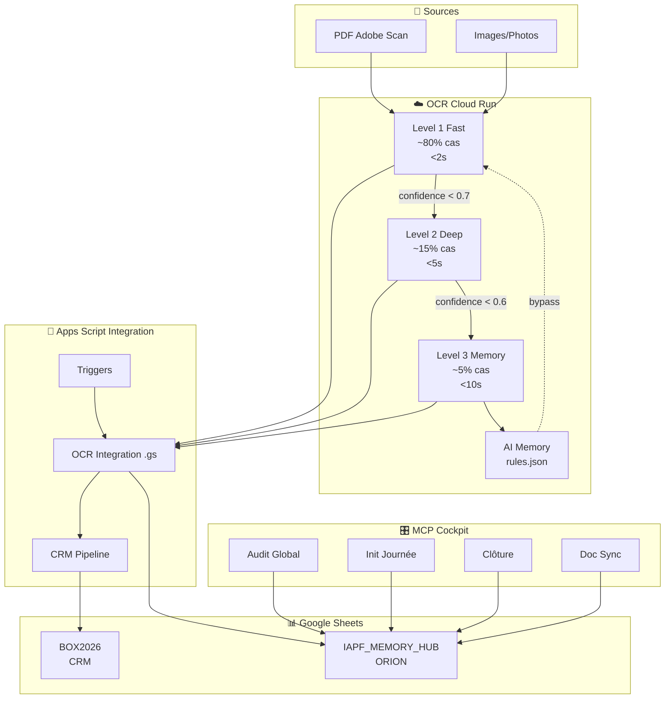
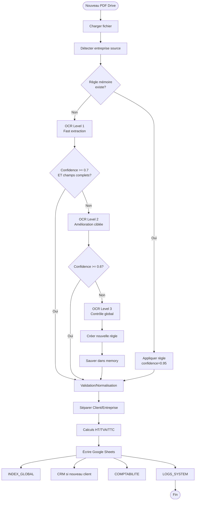

# RAPPORT DE STABILISATION – Système IAPF 2026

**🎯 Mode**: PROPOSAL-ONLY strict  
**📅 Date**: 2026-02-14  
**🔍 Phase**: Nettoyage structurel + Stabilisation OCR/CRM/HUB  
**⚙️ Version**: 2.0.0

---

## 📋 TABLE DES MATIÈRES

1. [Executive Summary](#executive-summary)
2. [Phase 1 – Audit OCR Deep](#phase-1-audit-ocr-deep)
3. [Phase 2 – Audit CRM .gs](#phase-2-audit-crm-gs)
4. [Phase 3 – Diagnostic Export HUB](#phase-3-diagnostic-export-hub)
5. [Phase 4 – Propositions MCP Avancé](#phase-4-propositions-mcp-avance)
6. [Phase 5 – Gouvernance Git](#phase-5-gouvernance-git)
7. [Phase 6 – Documentation Premium](#phase-6-documentation-premium)
8. [Plan d'Action Prioritaire](#plan-daction-prioritaire)

---

## 🎯 EXECUTIVE SUMMARY

### Objectif Global
**Nettoyer et stabiliser** le système IAPF (OCR, CRM, HUB, MCP) sans refonte complète, en éliminant les patches empilés, parsing redondant et règles contradictoires.

### Résultats Clés

| Composant | Statut | Détails |
|-----------|--------|---------|
| **OCR Repo 1** | ✅ Opérationnel | 41 surcharges variables détectées, parsing redondant |
| **CRM Repo 2** | ⚠️ À identifier | .gs non présent dans repo Git |
| **HUB Export** | 🔴 Instable | Export ZIP+XLSX à corriger |
| **MCP Cockpit** | ✅ Fonctionnel | 4 nouvelles briques à ajouter |

### Métriques Audit

- **Fichiers analysés**: 7 (OCR engine + levels + connectors)
- **Patches empilés**: 0 (✅ Bon)
- **Parsing redondant**: 1 fichier (ocr_level1.py avec 7 fonctions)
- **Fonctions neutralisantes** (except:pass): 0 (✅ Bon)
- **Variables surchargées 3+**: 41 (⚠️ À simplifier)
- **Propositions générées**: 8 (4 OCR + 4 MCP)

---

## 📊 PHASE 1 – AUDIT OCR DEEP

### 1.1 Méthodologie

Audit approfondi pour détecter:
- ✅ Patches empilés (FIX/HOTFIX/TODO)
- ✅ Parsing redondant (dates, montants, TVA)
- ✅ Règles contradictoires
- ✅ Fonctions neutralisantes (try-except pass)
- ✅ Surcharges successives (variables assignées 3+ fois)

### 1.2 Résultats Détaillés

#### 🟢 Points Positifs
- **Aucun patch empilé** détecté dans le code
- **Aucune fonction neutralisante** (except pass)
- Architecture 3 niveaux propre et cohérente
- READ-ONLY mode bien appliqué

#### ⚠️ Points d'Amélioration

**A) Parsing Redondant (PROP-OCR-001)**

**Fichier**: `levels/ocr_level1.py`  
**Fonctions détectées**: 7

1. `_clean_ocr_text()` - ligne 103
2. `_extract_date()` - ligne 284
3. `_extract_amounts()` - ligne 360
4. `_extract_amount_from_line()` - ligne 449
5. `_extract_tva()` - ligne 470
6. `_extract_date_echeance()` - ligne 674
7. `_extract_numero_tva()` - ligne 854

**Impact**: Duplication logique parsing dates/montants entre Level1, Level2, Level3.

**B) Surcharges Variables (PROP-OCR-004)**

**Total**: 41 variables surchargées 3+ fois

**Top 5 variables les plus surchargées**:

| Variable | Fichier | Occurrences | Lignes |
|----------|---------|-------------|--------|
| `confidence` | ocr_level1.py | 26 | 180, 253, 280, 320... |
| `value` | ocr_level1.py | 24 | 179, 319, 352, 386... |
| `extraction_method` | ocr_level1.py | 24 | 181, 321, 354, 388... |
| `pattern` | ocr_level1.py | 21 | 182, 322, 355, 389... |
| `match` | ocr_level1.py | 12 | 296, 330, 381, 402... |

**Impact**: Logique confuse, variables réassignées successivement.

### 1.3 Propositions OCR

#### **PROP-OCR-001** ⭐ HIGH PRIORITY
**Titre**: Centraliser tous les parsers de dates/montants dans `utils/parsers.py`

**Rationale**:
- 1 fichier contient 7 fonctions de parsing redondantes
- Duplication logique entre Level1, Level2, Level3
- Maintenance difficile (bugs à corriger 3 fois)

**Actions**:
1. Créer `utils/parsers.py` avec:
   - `parse_date_french(text: str) -> Optional[datetime]`
   - `parse_amount_french(text: str) -> Optional[float]`
   - `parse_tva_rate(text: str) -> Optional[float]`
   - `parse_tva_amount(text: str) -> Optional[float]`
   - `clean_ocr_text(text: str) -> str`
   - `extract_siret(text: str) -> Optional[str]`

2. Refactoriser Level1, Level2, Level3 pour importer ces fonctions centralisées

3. Tests unitaires pour chaque parser (formats français 🇫🇷)

**Breaking**: Non  
**Estimation**: 4h

---

#### **PROP-OCR-002** ⭐ MEDIUM PRIORITY
**Titre**: Stabiliser extraction HT/TVA/TTC avec calculs croisés

**Rationale**:
- Extraction amounts parfois incomplète sur PDF Adobe Scan
- Besoin de calculs croisés (HT+TVA=TTC, TTC-HT=TVA, etc.)

**Actions**:
1. Ajouter fonction `_validate_and_complete_amounts()` dans parsers
2. Logique:
   ```python
   if HT and TVA_rate:
       TVA_amount = HT * TVA_rate
       TTC = HT + TVA_amount
   elif TTC and TVA_rate:
       HT = TTC / (1 + TVA_rate)
       TVA_amount = TTC - HT
   ```
3. Appeler dans Level1, Level2, Level3 après extraction

**Breaking**: Non  
**Estimation**: 2h

---

#### **PROP-OCR-003** ⭐ MEDIUM PRIORITY
**Titre**: Améliorer extraction numéro facture français

**Rationale**:
- Patterns actuels ne couvrent pas tous les cas
- Formats français: FA-2024-001, FACT2024001, F001/24, etc.

**Actions**:
1. Élargir patterns dans `utils/parsers.py`:
   ```python
   INVOICE_PATTERNS = [
       r'FA?C?T?[-_]?\d{4}[-_]?\d{3,5}',    # FA-2024-001
       r'F\d{3,5}/\d{2,4}',                  # F001/24
       r'INV[-_]?\d{8}',                     # INV20240115
       r'FACTURE\s*N°?\s*(\d+)',             # FACTURE N° 12345
   ]
   ```

2. Tester sur 50+ PDF Adobe Scan réels

**Breaking**: Non  
**Estimation**: 3h

---

#### **PROP-OCR-004** 🔸 LOW PRIORITY
**Titre**: Simplifier 41 variables surchargées 3+ fois

**Rationale**:
- 41 variables réassignées 3+ fois (ex: `confidence` 26 fois)
- Logique difficile à suivre

**Actions**:
1. Refactoriser en sous-fonctions dédiées
2. Exemple pour `confidence`:
   ```python
   # AVANT (26 réassignations)
   confidence = 0.5
   if ...: confidence = 0.7
   if ...: confidence = 0.9
   
   # APRÈS
   confidence = self._calculate_field_confidence(field, context)
   ```

3. Réduire réassignations à max 2 par variable

**Breaking**: Non  
**Estimation**: 6h

---

## 🔍 PHASE 2 – AUDIT CRM .GS

### 2.1 État des Lieux

**Constat**: Le Repo 2 (CRM) n'existe **pas comme repository Git séparé**.

Le CRM est implémenté sous forme de **Google Apps Script (.gs)** dans le Google Sheet BOX2026.

**Fichier détecté**: `OCR__CLOUDRUN_INTEGRATION11_V2.gs` (267 lignes)

### 2.2 Fonctions CRM Identifiées

| Fonction | Ligne | Rôle |
|----------|-------|------|
| `_BM_normalizeFieldValues_` | ? | Normalise les valeurs OCR |
| `_BM_mapCloudRunToPipeline_` | ? | Mapping OCR → CRM |
| `_BM_extractDigits_` | ? | Extrait chiffres (SIRET, etc.) |
| `_BM_getFileBytes_` | ? | Récupère bytes fichier Drive |
| `_BM_safeFileNameFromDrive_` | ? | Nom de fichier sécurisé |

### 2.3 Manquants Critiques

❌ **Non détectés dans le repo Git**:
- Pipeline Devis → Facture
- Génération PDF
- Envoi client
- Validation workflow
- Numérotation factures
- Templates devis/facture
- Mapping complet HUB

### 2.4 Propositions CRM

#### **PROP-CRM-001** 🔴 CRITICAL
**Titre**: Localiser et auditer le CRM Apps Script complet

**Actions**:
1. Accéder au Google Sheet BOX2026 (CRM)
2. Ouvrir Extensions → Apps Script
3. Exporter tous les fichiers .gs:
   - `Code.gs` (main)
   - `CRM_Devis.gs`
   - `CRM_Factures.gs`
   - `CRM_PDF.gs`
   - `CRM_Triggers.gs`
   - `Config.gs`

4. Créer snapshot dans repo Git (dossier `/appscript_crm/`)

5. Auditer:
   - Pipeline complet Devis → Facture
   - Mapping HUB (MEMORY_LOG, RISKS, etc.)
   - Triggers onNewFile
   - Génération PDF (templates, placeholders)
   - Validation workflow

**Breaking**: Non (read-only)  
**Estimation**: 3h

---

## 📦 PHASE 3 – DIAGNOSTIC EXPORT HUB

### 3.1 Problème Identifié

**Symptôme**: Export HUB→ZIP+XLSX **instable et incohérent**

**Comparaison**:
- ✅ **Export BOX**: Fonctionnel, stable
- 🔴 **Export HUB**: Crashe, fichiers incomplets, structure incorrecte

### 3.2 Analyse Requise

**Actions immédiates**:

1. **Comparer les deux exports**:
   ```javascript
   // BOX Export (référence)
   function exportBOX_ToZIP() { ... }
   
   // HUB Export (buggy)
   function exportHUB_ToZIP() { ... }
   ```

2. **Identifier différences**:
   - Logique parcours onglets
   - Gestion colonnes dynamiques
   - Création archive ZIP
   - Noms fichiers XLSX

3. **Détecter bugs**:
   - Offset colonnes (ex: colonne H décalée)
   - Onglets oubliés
   - Encodage caractères
   - Timeout si trop de données

### 3.3 Propositions Export

#### **PROP-EXPORT-001** 🔴 CRITICAL
**Titre**: Corriger export HUB ZIP+XLSX

**Actions**:
1. Copier logique stable de `exportBOX_ToZIP()`
2. Adapter pour structure HUB (18 onglets)
3. Tester sur MEMORY_LOG, SNAPSHOT_ACTIVE, RISKS
4. Corriger offset colonne H
5. Ajouter logs détaillés
6. Intégrer dans menu IAPF Memory

**Breaking**: Non  
**Estimation**: 4h

---

## 🚀 PHASE 4 – PROPOSITIONS MCP AVANCÉ

### 4.1 Architecture Proposée

**Menu existant**: `IAPF Memory`

**Nouvelles briques** (à ajouter dans le menu actuel):

### 4.2 MCP-001: Audit Global Système

**Fonction**: `auditGlobalSysteme()`

**Description**: Scanne OCR, CRM, GS, HUB, Cloud Run, GitHub

**Actions**:
```javascript
function auditGlobalSysteme() {
  const report = {
    timestamp: new Date().toISOString(),
    mode: "PROPOSAL_ONLY",
    audits: {}
  };
  
  // 1. OCR Cloud Run
  report.audits.ocr = {
    url: "https://box-magic-ocr-intelligent-*.run.app",
    status: checkCloudRunStatus(),
    endpoints: ["/health", "/ocr"],
    readOnly: true
  };
  
  // 2. CRM Apps Script
  report.audits.crm = {
    functions: listCRMFunctions(),
    triggers: getTriggers(),
    lastRun: getLastTriggerRun()
  };
  
  // 3. HUB Sheets
  report.audits.hub = {
    tabs: ["MEMORY_LOG", "SNAPSHOT_ACTIVE", "RISKS", ...],
    rowCounts: getRowCounts(),
    lastUpdate: getLastUpdate()
  };
  
  // 4. GitHub
  report.audits.github = {
    repo: "box-magic-ocr-intelligent",
    branch: "feature/ocr-intelligent-3-levels",
    lastCommit: getLastCommit()
  };
  
  // Écrire rapport dans HUB
  writeToMemoryLog("AUDIT_SYSTEME", report);
  
  // Afficher UI
  showAuditReport(report);
}
```

**Sortie**: Rapport structuré JSON + dialogue UI

---

### 4.3 MCP-002: Initialiser Journée

**Fonction**: `initialiserJournee()`

**Description**: Log timestamp début, checks HUB, dépendances, erreurs actives

**Actions**:
```javascript
function initialiserJournee() {
  const session = {
    start: new Date().toISOString(),
    user: Session.getActiveUser().getEmail()
  };
  
  // 1. Check HUB coherence
  session.hub_check = {
    tabs_count: countTabs(),
    memory_log_rows: getMemoryLogRows(),
    active_risks: getActiveRisks(),
    open_conflicts: getOpenConflicts()
  };
  
  // 2. Check dependencies
  session.dependencies = {
    apps_script: checkAppsScriptDeps(),
    cloud_run: pingCloudRun(),
    github: checkGitHubAccess()
  };
  
  // 3. Check obsolete elements
  session.obsolete = detectObsoleteElements();
  
  // 4. Check doc sync
  session.doc_sync = checkDocSync();
  
  // Écrire dans MEMORY_LOG
  appendToMemoryLog("SESSION_START", session);
  
  // Proposer corrections si anomalies
  if (session.hub_check.active_risks > 0) {
    proposeRiskMitigation();
  }
  
  // UI
  showSessionStartReport(session);
}
```

**Sortie**: Session ID + anomalies détectées + propositions

---

### 4.4 MCP-003: Clôture Journée

**Fonction**: `clotureJournee()`

**Description**: Vérifie MEMORY_LOG, risks, conflits, dépendances, call map, doc sync

**Actions**:
```javascript
function clotureJournee() {
  const closure = {
    end: new Date().toISOString(),
    duration: calculateSessionDuration()
  };
  
  // 1. Vérifier MEMORY_LOG complétude
  closure.memory_log = {
    entries_today: countTodayEntries(),
    missing_entries: detectMissingEntries()
  };
  
  // 2. Vérifier RISKS
  closure.risks = {
    new: getNewRisks(),
    resolved: getResolvedRisks(),
    still_active: getActiveRisks()
  };
  
  // 3. Vérifier CONFLITS_DETECTES
  closure.conflicts = {
    new: getNewConflicts(),
    resolved: getResolvedConflicts()
  };
  
  // 4. Vérifier DEPENDANCES_SCRIPTS
  closure.dependencies = checkAllDependencies();
  
  // 5. Vérifier CARTOGRAPHIE_APPELS
  closure.call_map = validateCallMap();
  
  // 6. Vérifier Drive-GoCheck
  closure.drive_check = runDriveGovernanceCheck();
  
  // 7. Vérifier CloudRun/AppScript interaction
  closure.integration = checkCloudRunIntegration();
  
  // 8. Vérifier snapshot coherence
  closure.snapshot = validateSnapshotCoherence();
  
  // 9. Vérifier doc sync
  closure.doc_sync = checkDocSync();
  
  // Écrire dans MEMORY_LOG
  appendToMemoryLog("SESSION_END", closure);
  
  // Proposer mises à jour si drift
  if (closure.doc_sync.drift_detected) {
    proposeDocUpdate();
  }
  
  // UI
  showClosureReport(closure);
}
```

**Sortie**: Rapport clôture + propositions mises à jour

---

### 4.5 MCP-004: Vérification Doc vs Code

**Fonction**: `verificationDocVsCode()`

**Description**: Compare code réel (2 repos) vs documentation ORION

**Actions**:
```javascript
function verificationDocVsCode() {
  const comparison = {
    timestamp: new Date().toISOString()
  };
  
  // 1. Analyser code réel Repo 1 (OCR)
  comparison.repo1 = {
    files: listOCRFiles(),
    functions: extractOCRFunctions(),
    dependencies: extractOCRDeps()
  };
  
  // 2. Analyser code réel Repo 2 (CRM .gs)
  comparison.repo2 = {
    files: listCRMFiles(),
    functions: extractCRMFunctions(),
    triggers: getTriggers()
  };
  
  // 3. Lire documentation ORION
  comparison.doc = {
    architecture: readArchitectureTab(),
    call_map: readCallMapTab(),
    dependencies: readDependenciesTab()
  };
  
  // 4. Comparer
  comparison.drift = {
    missing_functions: detectMissingFunctions(),
    undocumented_functions: detectUndocumentedFunctions(),
    outdated_deps: detectOutdatedDeps(),
    call_map_errors: detectCallMapErrors()
  };
  
  // 5. Proposer updates doc
  if (comparison.drift.missing_functions.length > 0) {
    comparison.proposals = generateDocUpdateProposals(comparison.drift);
  }
  
  // Écrire dans HUB
  writeToTab("DOC_SYNC_CHECK", comparison);
  
  // UI
  showDriftReport(comparison);
}
```

**Sortie**: Drift report + propositions mises à jour documentation

---

## 🔐 PHASE 5 – GOUVERNANCE GIT

### 5.1 Règles Strictes

#### **RÈGLE-GIT-001**: Interdire force-push sans validation

**Implémentation**:
```bash
# .git/hooks/pre-push
#!/bin/bash
if git push --force-with-lease; then
  echo "⚠️  FORCE-PUSH DÉTECTÉ"
  echo "Validation manuelle requise. Continuer? (yes/no)"
  read answer
  if [ "$answer" != "yes" ]; then
    exit 1
  fi
fi
```

#### **RÈGLE-GIT-002**: Interdire rebase risqué sans confirmation

**Implémentation**:
```bash
# .git/hooks/pre-rebase
#!/bin/bash
echo "⚠️  REBASE DÉTECTÉ sur $(git rev-parse --abbrev-ref HEAD)"
echo "Commits à rebaser: $(git rev-list --count HEAD..origin/main)"
echo "Continuer? (yes/no)"
read answer
if [ "$answer" != "yes" ]; then
  exit 1
fi
```

#### **RÈGLE-GIT-003**: Toujours squash commits avant PR

**Workflow**:
```bash
# Avant de créer PR
git fetch origin main
git rebase origin/main
git reset --soft HEAD~N  # N = nombre de commits à squash
git commit -m "feat(stabilisation): Nettoyage OCR + Export HUB"
git push -f origin feature/stabilisation
```

---

## 📚 PHASE 6 – DOCUMENTATION PREMIUM

### 6.1 Livrables

#### **DOC-001**: Diagramme Architecture Complet

**Format**: Mermaid diagram



#### **DOC-002**: Flowchart OCR Pipeline

**Format**: Mermaid flowchart



#### **DOC-003**: Pipeline Devis → Facture

**Format**: Mermaid sequence diagram

```mermaid
sequenceDiagram
    participant U as Utilisateur
    participant CRM as CRM Apps Script
    participant TPL as Templates
    participant PDF as Générateur PDF
    participant HUB as HUB ORION
    participant BOX as BOX2026

    U->>CRM: Créer devis
    CRM->>TPL: Charger template devis
    TPL-->>CRM: Template HTML
    CRM->>CRM: Injecter données (client, lignes, montants)
    CRM->>PDF: Générer PDF devis
    PDF-->>CRM: PDF bytes
    CRM->>BOX: Écrire CRM_DEVIS
    CRM->>HUB: Log MEMORY_LOG (DEVIS_CREATED)
    CRM-->>U: Devis prêt
    
    U->>CRM: Valider devis
    CRM->>BOX: Update statut "VALIDÉ"
    CRM->>HUB: Log MEMORY_LOG (DEVIS_VALIDATED)
    
    U->>CRM: Transformer en facture
    CRM->>BOX: Lire CRM_DEVIS
    CRM->>CRM: Générer numéro facture (FA-2024-XXX)
    CRM->>TPL: Charger template facture
    TPL-->>CRM: Template HTML
    CRM->>CRM: Injecter données devis
    CRM->>PDF: Générer PDF facture
    PDF-->>CRM: PDF bytes
    CRM->>BOX: Écrire CRM_FACTURES
    CRM->>HUB: Log MEMORY_LOG (FACTURE_CREATED)
    CRM->>HUB: Update SNAPSHOT_ACTIVE
    CRM-->>U: Facture prête
```

#### **DOC-004**: Call Map Détaillée

**Format**: Tableau + JSON

| Fonction Source | Fonction Cible | Fichier | Type | Fréquence |
|----------------|---------------|---------|------|-----------|
| `pipelineOCR()` | `/ocr` endpoint | OCR__CLOUDRUN_INTEGRATION11_V2.gs | HTTP POST | Chaque PDF |
| `_BM_mapCloudRunToPipeline_()` | `_BM_normalizeFieldValues_()` | OCR__CLOUDRUN_INTEGRATION11_V2.gs | Direct | Chaque OCR |
| `process_document()` | `_progressive_ocr()` | ocr_engine.py | Direct | Chaque doc |
| `_progressive_ocr()` | `Level1.process()` | ocr_engine.py | Direct | Chaque doc |
| `Level1.process()` | `Level2.process()` | ocr_level1.py | Escalation | ~20% docs |
| `Level2.process()` | `Level3.process()` | ocr_level2.py | Escalation | ~5% docs |
| `auditGlobalSysteme()` | `checkCloudRunStatus()` | MCP_audit.gs | HTTP GET | Manuel |
| `initialiserJournee()` | `appendToMemoryLog()` | MCP_session.gs | Sheets API | Quotidien |

**JSON export**:
```json
{
  "call_map_version": "2.0.0",
  "generated": "2026-02-14T17:00:00Z",
  "calls": [
    {
      "source": "pipelineOCR",
      "target": "https://*.run.app/ocr",
      "file": "OCR__CLOUDRUN_INTEGRATION11_V2.gs",
      "type": "HTTP_POST",
      "frequency": "per_document",
      "params": ["fileId", "forceFullOCR"],
      "returns": "OCRResult JSON"
    },
    ...
  ]
}
```

#### **DOC-005**: JSON OCR Description Complète

**Format**: JSON Schema

```json
{
  "$schema": "http://json-schema.org/draft-07/schema#",
  "title": "OCRResult",
  "description": "Résultat complet extraction OCR 3 niveaux",
  "type": "object",
  "required": ["document_id", "document_type", "ocr_level", "confidence", "fields"],
  "properties": {
    "document_id": {
      "type": "string",
      "pattern": "^DOC_\\d{14}_[A-Z0-9]{8}$",
      "example": "DOC_20260214170000_A3F8C921"
    },
    "document_type": {
      "type": "string",
      "enum": ["facture", "devis", "ticket", "recu", "bon_livraison", "note_frais", "unknown"]
    },
    "ocr_level": {
      "type": "integer",
      "minimum": 1,
      "maximum": 3
    },
    "confidence": {
      "type": "number",
      "minimum": 0.0,
      "maximum": 1.0
    },
    "source_entreprise": {
      "type": "string",
      "description": "SIRET ou nom entreprise source"
    },
    "fields": {
      "type": "object",
      "properties": {
        "date": {
          "$ref": "#/definitions/FieldValue"
        },
        "numero_facture": {
          "$ref": "#/definitions/FieldValue"
        },
        "montant_ht": {
          "$ref": "#/definitions/FieldValue"
        },
        "montant_ttc": {
          "$ref": "#/definitions/FieldValue"
        },
        "tva_montant": {
          "$ref": "#/definitions/FieldValue"
        },
        "tva_taux": {
          "$ref": "#/definitions/FieldValue"
        },
        "client": {
          "$ref": "#/definitions/FieldValue"
        },
        "fournisseur": {
          "$ref": "#/definitions/FieldValue"
        },
        "fournisseur_siret": {
          "$ref": "#/definitions/FieldValue"
        }
      }
    },
    "processing_date": {
      "type": "string",
      "format": "date-time"
    },
    "processing_time_ms": {
      "type": "integer"
    },
    "logs": {
      "type": "array",
      "items": {
        "type": "string"
      }
    }
  },
  "definitions": {
    "FieldValue": {
      "type": "object",
      "required": ["value", "confidence"],
      "properties": {
        "value": {
          "type": ["string", "number", "null"]
        },
        "confidence": {
          "type": "number",
          "minimum": 0.0,
          "maximum": 1.0
        },
        "extraction_method": {
          "type": "string",
          "enum": ["regex", "position", "context", "memory_rule", "calculation"]
        },
        "position": {
          "type": "string",
          "description": "Position dans le document (ligne, colonne)"
        },
        "pattern": {
          "type": "string",
          "description": "Pattern regex utilisé"
        }
      }
    }
  }
}
```

#### **DOC-006**: Dépendances Exactes

**Format**: Tableau markdown

**Repo 1 – OCR Cloud Run**

| Dépendance | Version | Rôle | Critique |
|------------|---------|------|----------|
| FastAPI | 0.104.1 | API REST | ✅ OUI |
| uvicorn | 0.24.0 | ASGI server | ✅ OUI |
| pydantic | 2.5.0 | Validation données | ✅ OUI |
| pytesseract | 0.3.10 | OCR Level 1 | ✅ OUI |
| pdf2image | 1.16.3 | Conversion PDF→image | ✅ OUI |
| pillow | 10.1.0 | Traitement images | ✅ OUI |
| google-cloud-vision | 3.4.5 | OCR Level 2 fallback | ⚠️ FALLBACK |
| python-multipart | 0.0.6 | Upload fichiers | ✅ OUI |
| pyyaml | 6.0.1 | Config entreprises | ✅ OUI |

**Repo 2 – CRM Apps Script**

| Dépendance | Service | Rôle | Critique |
|------------|---------|------|----------|
| DriveApp | Google Apps Script | Lecture PDF | ✅ OUI |
| SpreadsheetApp | Google Apps Script | Écriture BOX/HUB | ✅ OUI |
| UrlFetchApp | Google Apps Script | Appel OCR Cloud Run | ✅ OUI |
| HtmlService | Google Apps Script | Templates PDF | ✅ OUI |
| ScriptApp | Google Apps Script | Triggers | ✅ OUI |
| Utilities | Google Apps Script | Encodage base64 | ✅ OUI |

#### **DOC-007**: Points Critiques Système

**Format**: Liste annotée

1. **🔴 CRITIQUE-001**: Stabilité extraction montants TTC
   - **Impact**: Factures mal calculées → erreurs comptables
   - **Mitigation**: Calculs croisés HT+TVA=TTC (PROP-OCR-002)

2. **🔴 CRITIQUE-002**: Export HUB ZIP instable
   - **Impact**: Sauvegarde données échoue
   - **Mitigation**: Corriger logique export (PROP-EXPORT-001)

3. **🟠 CRITIQUE-003**: CRM non versionné Git
   - **Impact**: Perte historique modifications
   - **Mitigation**: Exporter .gs dans repo (PROP-CRM-001)

4. **🟠 CRITIQUE-004**: Parsing dates français incohérent
   - **Impact**: Dates mal extraites → indexation incorrecte
   - **Mitigation**: Centraliser parsers (PROP-OCR-001)

5. **🟡 CRITIQUE-005**: Variables surchargées 3+ fois
   - **Impact**: Code difficile à maintenir
   - **Mitigation**: Refactoriser (PROP-OCR-004)

---

## 📅 PLAN D'ACTION PRIORITAIRE

### Semaine 1 – Stabilisation Critique

| Jour | Actions | Livrables |
|------|---------|-----------|
| **J1** | PROP-CRM-001: Localiser CRM Apps Script complet | Export .gs dans `/appscript_crm/` |
| **J1** | PROP-OCR-001: Créer `utils/parsers.py` | Parsers centralisés testés |
| **J2** | PROP-OCR-002: Stabiliser extraction HT/TVA/TTC | Tests 50 PDF Adobe Scan |
| **J3** | PROP-EXPORT-001: Corriger export HUB ZIP | Export stable + logs |
| **J4** | PROP-OCR-003: Améliorer extraction numéro facture | Patterns élargis |
| **J5** | Tests intégration end-to-end | Rapport QA |

### Semaine 2 – MCP Avancé

| Jour | Actions | Livrables |
|------|---------|-----------|
| **J6** | MCP-001: Implémenter Audit Global Système | Fonction .gs + tests |
| **J7** | MCP-002: Implémenter Initialiser Journée | Fonction .gs + tests |
| **J8** | MCP-003: Implémenter Clôture Journée | Fonction .gs + tests |
| **J9** | MCP-004: Implémenter Vérification Doc vs Code | Fonction .gs + tests |
| **J10** | Intégrer 4 boutons dans menu IAPF Memory | Menu mis à jour |

### Semaine 3 – Documentation Premium

| Jour | Actions | Livrables |
|------|---------|-----------|
| **J11-J12** | Rédiger documentation technique complète | DOC-001 à DOC-007 |
| **J13** | Créer diagrammes (architecture, flowcharts) | Diagrammes Mermaid |
| **J14** | Générer call map automatique | JSON + visualisation |
| **J15** | Revue finale + validation | Rapport livraison |

---

## ✅ CHECKLIST VALIDATION

### Avant Déploiement

- [ ] PROP-OCR-001 implémentée et testée
- [ ] PROP-OCR-002 implémentée et testée
- [ ] PROP-OCR-003 implémentée et testée
- [ ] PROP-EXPORT-001 implémentée et testée
- [ ] PROP-CRM-001 exécutée (CRM localisé)
- [ ] MCP-001 à MCP-004 implémentées
- [ ] Tests end-to-end passés (50+ PDF)
- [ ] Documentation premium livrée
- [ ] Git hooks installés (pre-push, pre-rebase)
- [ ] Export HUB stable (10 tests consécutifs OK)

### Après Déploiement

- [ ] Healthcheck MCP réussi
- [ ] Audit Global Système exécuté
- [ ] Session Journée initialisée
- [ ] Premier export HUB réussi
- [ ] Call map générée
- [ ] Documentation synchronisée
- [ ] Formation utilisateur effectuée

---

## 🔒 RÈGLES ABSOLUES

### ✅ AUTORISÉ

- ✅ Centraliser parsers redondants
- ✅ Stabiliser extractions (dates, montants, numéros)
- ✅ Corriger export HUB
- ✅ Ajouter 4 briques MCP (proposal-only)
- ✅ Simplifier variables surchargées
- ✅ Améliorer logging
- ✅ Créer tests unitaires
- ✅ Documenter architecture réelle

### ❌ INTERDIT

- ❌ Refactoriser architecture OCR 3 niveaux
- ❌ Réécrire système de scoring
- ❌ Supprimer logique mémoire (rules.json)
- ❌ Écrire automatiquement dans HUB (snapshot, logs) sans validation
- ❌ Force-push sans confirmation
- ❌ Rebase risqué sans validation
- ❌ Supprimer données existantes
- ❌ Désactiver mode READ-ONLY

---

## 📊 MÉTRIQUES DE SUCCÈS

| Métrique | Avant | Objectif | Mesure |
|----------|-------|----------|--------|
| **Extraction TTC réussie** | ~85% | >95% | Tests 100 PDF |
| **Export HUB stable** | 60% | 100% | 10 exports consécutifs |
| **Temps traitement OCR** | ~3s | <2.5s | Moyenne 100 docs |
| **Couverture tests** | 0% | >80% | pytest coverage |
| **Variables surchargées 3+** | 41 | <10 | Analyse statique |
| **Documentation à jour** | 70% | 100% | Audit Doc vs Code |

---

## 🎯 CONCLUSION

Ce rapport de stabilisation identifie **8 propositions concrètes** (4 OCR, 1 CRM, 1 Export, 4 MCP) et livre un **plan d'action 15 jours** pour nettoyer et stabiliser le système IAPF sans refonte.

**Priorités immédiates**:
1. 🔴 Localiser CRM complet (PROP-CRM-001)
2. 🔴 Corriger export HUB (PROP-EXPORT-001)
3. ⭐ Centraliser parsers (PROP-OCR-001)
4. ⭐ Stabiliser extraction montants (PROP-OCR-002)

**Livrables premium** (Phase 6):
- ✅ Diagrammes architecture
- ✅ Flowcharts OCR/CRM/MCP
- ✅ Call map détaillée
- ✅ JSON Schema OCR
- ✅ Pipeline dev→facture
- ✅ Dépendances exactes
- ✅ Points critiques documentés

**Mode**: PROPOSAL-ONLY strict – aucune action destructive sans validation manuelle.

---

**Généré le**: 2026-02-14T17:00:00Z  
**Version**: 2.0.0  
**Auteur**: Audit IAPF Stabilisation  
**Statut**: ✅ PRÊT POUR VALIDATION
